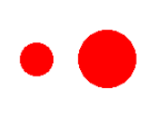

_Gruppenarbeit:_ Diese Aufgabe darf in Gruppen mit bis zu 2 Teilnehmern bearbeitet und abgegeben werden.

Formen wie Kreise oder Rechtecke werden oft zur Visualisierung der Größe eines Wertes verwendet. Es zeigt sich dabei, dass die subjektive Wahrnehmung der Größe einer Form nicht notwendig proportional zu deren Flächeninhalt ist.

Für Kreise wird folgender Zusammenhang angenommen:

(wahrgenommenes Größenverhältnis) = (tatsächliches Verhältnis der Flächeninhalte)^x,

wobei der Wert von x bei verschiedenen Personen leicht variiert.

Ziel dieser Aufgabe ist es, ein Programm zu entwerfen und zu implementieren, mit dem man x für verschiedene Testpersonen bestimmen kann.

Entwerfen Sie eine Strategie, wie man x messen kann.
Implementieren Sie ein entsprechendes Programm in Java für die Formen Kreis und Quadrat.
Führen Sie eine Messreihe durch. Falls Sie Freiwillige finden, führen Sie die Messung mit verschiedenen Personen durch.
Visualisieren Sie das Ergebnis in geeigneter Weise.