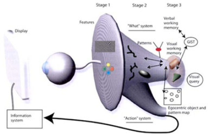

_Gruppenarbeit:_ Diese Aufgabe darf in Gruppen mit bis zu 2 Teilnehmern bearbeitet und abgegeben werden.

Bei der präattentiven Wahrnehmung werden Objekteigenschaften wahrgenommen, ohne dass dies in das Bewusstsein der entsprechenden Person dringt, und ohne dass es einer besonderen Aufmerksamkeit der Person bedarf. Die Verarbeitung geschieht weitestgehend parallel und in Bruchteilen einer Sekunde.

Ziel dieser Übung ist es, eine Applikation zu implementieren, die feststellen kann, ob eine Objekteigenschaft (wie Form, Farbe, etc.) präattentiv wahrgenommen wird. Darüber hinaus sollen qualitative und quantitative Aussagen gemacht werden: Welche Eigenschaft eignet sich besonders gut, welche nicht. Wie schnell ist die Wahrnehmung (wie lange muss ein Bild gezeigt werden, bis das entsprechende Objekt von der Testperson identifiziert werden kann).

1. Entwerfen Sie ein Programm, das verschiedene Eigenschaften (siehe 02-Visual_Perception.pdf) dahingehend testet, ob diese präattentiv wahrgenommen werden.
2. Versuchen Sie zu messen, wie schnell die verschiedenen Eigenschaften erkannt werden. (Überlegen Sie sich, mit welcher Versuchsanordnung sich das am besten messen lässt.)
3. Versuchen Sie zu belegen, dass die präattentive Wahrnehmung von der Vielfalt der Distraktoren abhängt. (02-Visual_Perception.pdf Folie 40: "Degree of difference of non-targets from each other")
4. Weisen Sie ebenfalls nach, dass die Suche nach zusammengesetzten Eigenschaften (Conjunction Search, 02-Visual_Perception.pdf Folie 25) nicht präattentiv ist. (Messen Sie z.B. die deutlich längeren Zeiten einer solchen Suche.)
